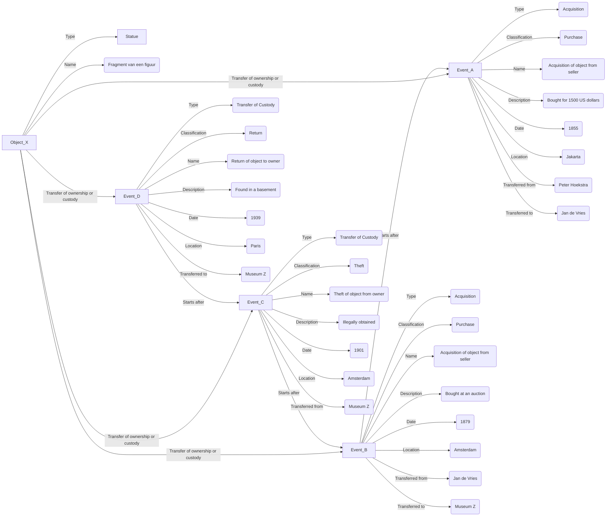

# Provenance information: conceptual model

Aim of the model: to track the events in which a cultural heritage object is created or discovered, transferred between owners or custodians, until it is lost, destroyed or in its present location. The model uses [CIDOC-CRM](https://www.cidoc-crm.org/) as foundation.

## Status

Draft

TODO: add information about the thesauri that must be used for certain properties.

## Entities

### Cultural Heritage Object (CHO)

Baseline: the Object ID standard

|Name|Cardinality|Description|Example|
|-|-|-|-|
|ID|1|Identifier of the object|`https://linkeddata.cultureelerfgoed.nl/colonialheritage/colonialobjects/id/13290`|
|Type|1 or more|Type of the object|`Statue`|
|Name|0 or 1|Name of the object|`Fragment van een figuur`|
|Description|0 or 1|Name of the object|`Staande figuur, mogelijk een figuur met dwerggroei voorstellend. Fragment afkomstig van kleine figurines uit graven.`|
|Creator|0 or more|The agent who created the object|`Volk van Teotihuacan`|
|Transfer of ownership or custody|0 or more|References to provenance events|`https://linkeddata.cultureelerfgoed.nl/colonialheritage/colonialobjects/id/123`|

### Provenance Event

|Name|Cardinality|Description|Example|
|-|-|-|-|
|ID|1|Identifier of the event|`https://linkeddata.cultureelerfgoed.nl/colonialheritage/colonialobjects/id/123`|
|Type|1|Type of the event|`Acquisition` (for transfer of legal ownership), `Transfer of Custody` (for transfer of physical custody or the legal responsibility for physical custody)|
|Classification|0 or 1|Classification of the type of the event|`Gift`, `Purchase`, `Loan`, `Movement`, `Theft`, `Loss`|
|Qualifier|0 or 1|Qualifier of the classification|`Possibly`, `Probably`|
|Name|0 or 1|Name of the event|`Acquisition of object from seller`, `Theft of object from owner`|
|Description|0 or 1|Description of the event|-|
|Source|0 or 1|Sources on which the provenance information is based, e.g. URLs of websites, book titles|-|
|Transferred from|0 or 1|The agent (person, organisation) who owned or held the object|`Peter Hoekstra`, `Archive A`|
|Transferred to|0 or 1|The agent (person, organisation) who received the object|`Jan de Vries`, `Museum B`|
|Location|0 or 1|Location of the event|`Batavia`, `Amsterdam`, `Indonesia`, `Java`|
|Date|0 or 1|Date of the event|`1887`, `1887-06-05`, `1887-1889`|
|Starts after|0 or 1|Reference to another provenance event, earlier in time|-|
|Ends before|0 or 1|Reference to another provenance event, later in time|-|
|Related to|0 or more|Reference to an event to which the provenance event is (somehow) related|`http://www.wikidata.org/entity/Q2201391` ("Dutch intervention in Lombok and Karangasem")|

TBD:
1. Do we know - from the source data - whether a provenance event was a transfer of _legal_ ownership? Or is this unknown and do we only know that an object has been 'moved' to another agent?
1. NMVW's data contains the names and roles of the persons involved in provenance events. For example: the curator that bought an object. Is it useful to register this? Or are only the organisations to which the persons belonged important? -> For now we'll register this information in the 'Description' attribute
1. NMVW primarily registers the transfers of custody. That's because the museum is not the legal owner of objects - that's the Dutch government.
1. NMVW registers provenance information from a data provider's perspective, not from an object's perspective. For example: if an object was handed over to a museum in Indonesia, the museum registers this as a 'deaccession' event. But from an object's perspective this is not a deaccession - it lives on at a different location, in the hands of a new owner and custodian.
1. NMVW registers 'administrative' changes as provenance events, e.g. if an object received a new object number. But the owner or the custodian did not change. Should we expose this information? See also: https://linked.art/model/provenance/curation/.
1. NMVW sometimes 'discovers' objects in its collection that it wasn't aware of. Should we register this as a separate provenance event? Or is this irrelevant because the owner and custodian did not change?

## Example

