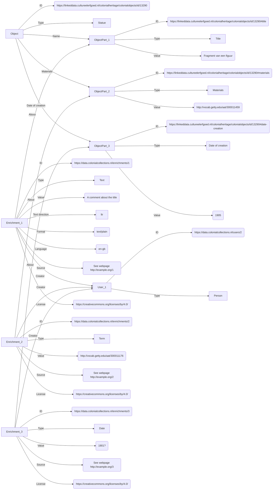

# User enrichments: conceptual model

Aim of the model: to capture enrichments of users. An 'enrichment' (also known as an 'annotation') is additional information about an entity, e.g. (the metadata of) a cultural heritage object or a person.

Also see the [frontend designs](https://gui-prototype.colonialcollections.nl/object.html) for an impression of how the user enrichments can be integrated into the Research App.

## Status

Draft

## Design principles

1. An enrichment can be anything. For example: it could be a comment about a heritage object as a whole or a translation of a specific attribute (e.g. the title)
1. The content of an enrichment is intentionally undefined/uncategorized. For example: it could be a question or a truth claim
1. An enrichment is created by a specific user. This user is the owner of and responsible for the enrichment
1. An enrichment has a specific license, to make clear what others are allowed to do with it
1. An enrichment is never a deletion of original information, but it can be a correction; the provider of the original information can then decide what to do with it

## Enrichment types

There are two types: basic enrichments and compound enrichments.

### Basic enrichment types

A 'basic enrichment' is additional information about a specific property of an entity. For example: a comment about the description or the translation of the title.
A basic enrichment can be further divided into subtypes, outlined underneath.

#### Text

An enrichment in the form of a text, e.g. a comment about existing information or a new text, such as a missing description.

|Name|Cardinality|Description|Example|
|-|-|-|-|
|ID|1|Identifier of the enrichment|`https://data.colonialcollections.nl/enrichments/1`|
|Value|1|Content of the enrichment: a text|`A comment about the title`|
|Text direction|1|Direction of the text|`ltr`, `rtl`|
|Format|1|Format code of the text, according to the IANA media types|`text/plain`|
|Language|0 or 1|Language code of the text, according to ISO 639-1|`en-gb`|
|Source|0 or more|Statement(s) about the source(s) the creator used when creating this enrichment, e.g. URLs of websites, book titles|`See webpage http://example.org/1`|
|About|1|Identifier of the information the enrichment is about|`https://linkeddata.cultureelerfgoed.nl/colonialheritage/colonialobjects/id/13290#title`|
|Creator|1|Identifier of the user who created the enrichment|`https://data.colonialcollections.nl/users/2`|
|Date created|1|Date on which the enrichment was created, in UTC|`2023-08-10T12:17:28`|
|License|1|Identifier of the license of the enrichment|`https://creativecommons.org/licenses/by/4.0/`|

#### Reference

An enrichment in the form of a new reference. A reference can be e.g. a term from a terminology source or any other 'thing' that has an IRI.

|Name|Cardinality|Description|Example|
|-|-|-|-|
|ID|1|Identifier of the enrichment|`https://data.colonialcollections.nl/enrichments/2`|
|Value|1|Content of the enrichment: the identifier of the reference|`http://vocab.getty.edu/aat/300011176`|
|Source|0 or more|Statement(s) about the source(s) the creator used when creating this enrichment, e.g. URLs of websites, book titles|`See webpage http://example.org/2`|
|About|1|Identifier of the information the enrichment is about|`https://linkeddata.cultureelerfgoed.nl/colonialheritage/colonialobjects/id/13290#materials`|
|Creator|1|Identifier of the user who created the enrichment|`https://data.colonialcollections.nl/users/2`|
|Date created|1|Date on which the enrichment was created, in UTC|`2023-08-10T12:17:28`|
|License|1|Identifier of the license of the enrichment|`https://creativecommons.org/licenses/by/4.0/`|

#### Date

An enrichment in the form of a new date.

|Name|Cardinality|Description|Example|
|-|-|-|-|
|ID|1|Identifier of the enrichment|`https://data.colonialcollections.nl/enrichments/3`|
|Value|1|Content of the enrichment: a date according to [EDTF](https://www.loc.gov/standards/datetime/)|`1901`, `1901?`, `1900/1905`|
|Source|0 or more|Statement(s) about the source(s) the creator used when creating this enrichment, e.g. URLs of websites, book titles|`See webpage http://example.org/3`|
|About|1|Identifier of the information the enrichment is about|`https://linkeddata.cultureelerfgoed.nl/colonialheritage/colonialobjects/id/13290#date-creation`|
|Creator|1|Identifier of the user who created the enrichment|`https://data.colonialcollections.nl/users/2`|
|Date created|1|Date on which the enrichment was created, in UTC|`2023-08-10T12:17:28`|
|License|1|Identifier of the license of the enrichment|`https://creativecommons.org/licenses/by/4.0/`|

### Compound enrichment types

A 'compound enrichment' is additional information about a set of properties of an entity.
A compound enrichment consists of 1 or more basic enrichments.
A compound enrichment can be further divided into subtypes, outlined underneath.

#### Provenance event

An enrichment in the form of a new provenance event.

|Name|Cardinality|Description|Example|
|-|-|-|-|
|ID|1|Identifier of the enrichment|`https://data.colonialcollections.nl/enrichments/4`|
|Type|1|Type of the event|`Acquisition` (for transfer of legal ownership), `Transfer of Custody` (for transfer of physical custody or the legal responsibility for physical custody)|
|Classification|0 or 1|Classification of the type of the event|`Gift`, `Purchase`, `Loan`, `Movement`, `Theft`, `Loss`|
|Qualifier|0 or 1|Qualifier of the classification|`Possibly`, `Probably`|
|Name|0 or 1|Name of the event|`Acquisition of object from seller`, `Theft of object from owner`|
|Description|0 or 1|Description of the event|-|
|Transferred from|0 or 1|The agent (person, organisation) who owned or held the object|`Peter Hoekstra`, `Archive A`|
|Transferred to|0 or 1|The agent (person, organisation) who received the object|`Jan de Vries`, `Museum B`|
|Location|0 or 1|Location of the event|`Batavia`, `Amsterdam`, `Indonesia`, `Java`|
|Date|0 or 1|Date of the event|`1887`, `1887-06-05`, `1887-1889`|
|Starts after|0 or 1|Reference to another provenance event, earlier in time|-|
|Ends before|0 or 1|Reference to another provenance event, later in time|-|
|Related to|0 or more|Reference to an event to which the provenance event is (somehow) related|`http://www.wikidata.org/entity/Q2201391` ("Dutch intervention in Lombok and Karangasem")|
|Source|0 or more|Statement(s) about the source(s) the creator used when creating this enrichment, e.g. URLs of websites, book titles|`See webpage http://example.org/3`|
|About|1|Identifier of the information the enrichment is about|`https://linkeddata.cultureelerfgoed.nl/colonialheritage/colonialobjects/id/13290#P30i_custody_transferred_through`|
|Creator|1|Identifier of the user who created the enrichment|`https://data.colonialcollections.nl/users/2`|
|Date created|1|Date on which the enrichment was created, in UTC|`2023-08-10T12:17:28`|
|License|1|Identifier of the license of the enrichment|`https://creativecommons.org/licenses/by/4.0/`|

## Example

## To be discussed

1. Do we need more enrichment types? For example: is there a need to have a separate type for 'Dimensions'? Or are these of type 'text'?
1. Is a 'Like' also a type of enrichment?
