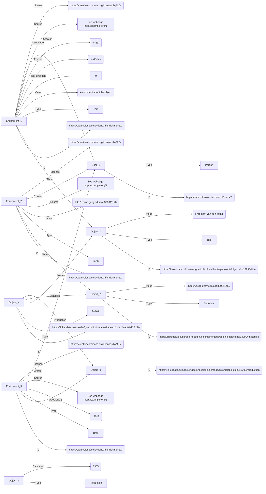

# User enrichments: conceptual model

Aim of the model: to capture enrichments of users. An 'enrichment' (also known as an 'annotation') is additional information about an entity, e.g. a cultural heritage object or a person.

Status: draft

## Design principles

1. An enrichment is about specific information from a data provider, e.g. about the 'title' or the 'materials' of a cultural heritage object. An enrichment is not about the object as a whole
1. Apart from (1), an enrichment can be anything. For example: a translation, a comment, a new date, a new term
1. An enrichment is created by a specific user. This user is the owner of and responsible for the enrichment
1. An enrichment has a specific license, to make clear what others are allowed to do with it
1. An enrichment is never a deletion of original information, but it can be a correction; the provider of the original information can then decide what to do with it

## Enrichment types

### Text

|Name|Cardinality|Description|Example|
|-|-|-|-|
|ID|1|Identifier of the enrichment|`https://data.colonialcollections.nl/enrichments/1`|
|Type|1|Type of enrichment|`Text`|
|Value|1|Content of the enrichment: a text|`A comment about the object`|
|Text direction|1|Direction of the text|`ltr`, `rtl`|
|Format|1|Format code of the text, according to the IANA media types|`text/plain`|
|Language|0 or 1|Language code of the text, according to ISO 639-1|`en-gb`|
|Source|0 or more|Statement(s) about the source(s) the creator used when creating this enrichment, e.g. URLs of websites, book titles|`See webpage http://example.org/1`|
|About|1|Identifier of the information the enrichment is about|`https://linkeddata.cultureelerfgoed.nl/colonialheritage/colonialobjects/id/13290#title`|
|Creator|1|Identifier of the user who created the enrichment|`https://data.colonialcollections.nl/users/2`|
|Date created|1|Date on which the enrichment was created, in UTC|`2023-08-10T12:17:28`|
|License|1|Identifier of the license of the enrichment|`https://creativecommons.org/licenses/by/4.0/`|

### Term

A 'term' is a description of an entity (e.g. person, location) or concept in a terminology source, e.g. a thesaurus.

|Name|Cardinality|Description|Example|
|-|-|-|-|
|ID|1|Identifier of the enrichment|`https://data.colonialcollections.nl/enrichments/2`|
|Type|1|Type of enrichment|`Term`|
|Value|1 or more?|Content of the enrichment: the identifier of a term|`http://vocab.getty.edu/aat/300011176`|
|Source|0 or more|Statement(s) about the source(s) the creator used when creating this enrichment, e.g. URLs of websites, book titles|`See webpage http://example.org/2`|
|About|1|Identifier of the information the enrichment is about|`https://linkeddata.cultureelerfgoed.nl/colonialheritage/colonialobjects/id/13290#materials`|
|Creator|1|Identifier of the user who created the enrichment|`https://data.colonialcollections.nl/users/2`|
|Date created|1|Date on which the enrichment was created, in UTC|`2023-08-10T12:17:28`|
|License|1|Identifier of the license of the enrichment|`https://creativecommons.org/licenses/by/4.0/`|

### Date

|Name|Cardinality|Description|Example|
|-|-|-|-|
|ID|1|Identifier of the enrichment|`https://data.colonialcollections.nl/enrichments/3`|
|Type|1|Type of enrichment|`Date`|
|Value|1|Content of the enrichment: a date according to [EDTF](https://www.loc.gov/standards/datetime/)|`1901`, `1901?`, `1900/1905`|
|Source|0 or more|Statement(s) about the source(s) the creator used when creating this enrichment, e.g. URLs of websites, book titles|`See webpage http://example.org/3`|
|About|1|Identifier of the information the enrichment is about|`https://linkeddata.cultureelerfgoed.nl/colonialheritage/colonialobjects/id/13290#production`|
|Creator|1|Identifier of the user who created the enrichment|`https://data.colonialcollections.nl/users/2`|
|Date created|1|Date on which the enrichment was created, in UTC|`2023-08-10T12:17:28`|
|License|1|Identifier of the license of the enrichment|`https://creativecommons.org/licenses/by/4.0/`|

## Example

## To be discussed

1. Can users only create 'basic' enrichments or also 'compound' enrichments (e.g. a provenance event that consists of multiple basic enrichments, e.g. a text, dates and terms)?
1. Do we need more enrichment types? For example: is there a need to have a separate type for 'Dimensions'? Or are these of type 'text'?
1. Is a 'Like' also a type of enrichment?
